<!-- Galaxy Profile README Template
     Customize this file with your own info, then rename it to README.md
     in your GitHub profile repo (github.com/YOUR_USERNAME/YOUR_USERNAME).
     The SVG paths below point to assets/generated/ which are auto-generated
     by the GitHub Actions workflow or by running: python -m generator.main -->

  

 

  

 

  

 

  

 

<strong>More about me</strong>

 

Currently focused on building autonomous AI agents and engineering scalable data workflows.
When I'm not coding, you can usually find me hitting the gym, experimenting with new recipes in the kitchen, or organizing gaming matches with friends.

 

  
  

